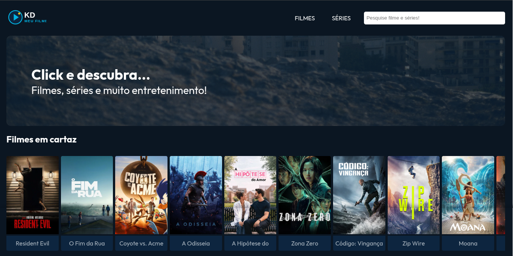
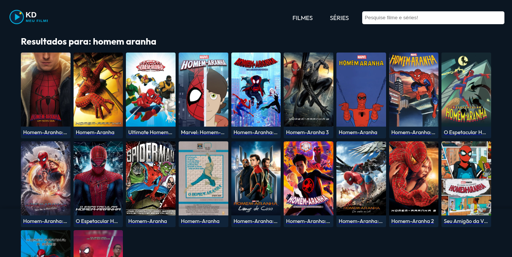
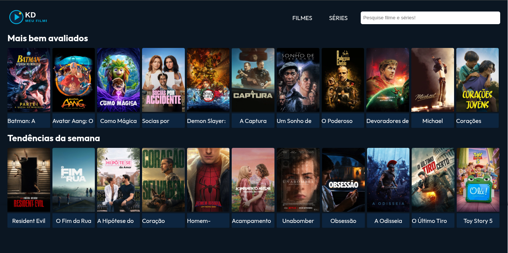
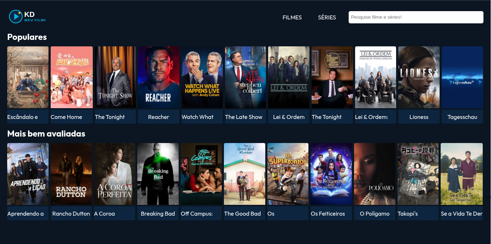
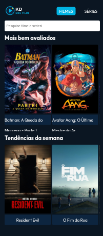

<div align="center">

# 🎬 KD Meu Filme

### Encontre seu próximo filme ou série.

**Uma aplicação web para explorar filmes e séries, pesquisar títulos e descobrir novos conteúdos.**

<br>

[](https://react.dev/)
[](https://vite.dev/)
[](https://developer.mozilla.org/docs/Web/JavaScript)
[](https://axios-http.com/)
[](https://reactrouter.com/)

<br>

<a href="https://github.com/PcfSilva/kd-meu-filme">
  
</a>

</div>

---

## 🖼️ Preview

<div align="center">



</div>

---

## 📖 Sobre o projeto

O **KD Meu Filme** é uma aplicação web desenvolvida com **React** para explorar filmes e séries, consultar informações e realizar buscas por títulos.

O projeto foi criado como parte da minha jornada de aprendizado em desenvolvimento web, com foco em colocar em prática conceitos de **React, JavaScript, consumo de APIs, componentização, roteamento e responsividade**.

A interface foi pensada para proporcionar uma experiência simples e visual, com cards de conteúdos organizados em diferentes categorias.

---

## ✨ Funcionalidades

### 🔎 Pesquisa

Pesquise por filmes e séries utilizando a barra de busca localizada no cabeçalho.



### 🎬 Catálogo de filmes

Visualize filmes organizados em uma interface de cards, com pôster e título.



### 📺 Catálogo de séries

Explore séries disponíveis através de uma página dedicada.



### 🏠 Página inicial

A Home apresenta diferentes categorias de conteúdos, como **Mais bem avaliados**, **Tendências da semana** e **Filmes em cartaz**.


### 📱 Interface responsiva

O layout se adapta a diferentes tamanhos de tela, incluindo dispositivos móveis.

<div align="center">

</div>

---

## 🧩 Principais recursos

- 🔎 Busca por filmes e séries
- 🎬 Catálogo de filmes
- 📺 Catálogo de séries
- ⭐ Conteúdos mais bem avaliados
- 🔥 Tendências da semana
- 🎞️ Filmes em cartaz
- 📱 Layout responsivo
- 🖼️ Cards com pôsteres
- 🧭 Navegação entre páginas
- 🌐 Consumo de API
- ⚡ Renderização dinâmica dos dados

---

## 🛠️ Tecnologias utilizadas

| Tecnologia | Utilização |
|---|---|
| **React** | Construção da interface |
| **JavaScript** | Lógica da aplicação |
| **Vite** | Ambiente de desenvolvimento e build |
| **Axios** | Requisições HTTP |
| **React Router** | Navegação e gerenciamento de rotas |
| **CSS** | Estilização e responsividade |
| **ESLint** | Padronização e análise do código |
| **Git/GitHub** | Versionamento do projeto |

---

## 🧠 Conceitos praticados

Este projeto foi desenvolvido para praticar conceitos importantes do desenvolvimento Front-End:

```text
React
├── Componentização
├── Props
├── Hooks
├── Eventos
├── Renderização dinâmica
└── Reutilização de componentes

JavaScript
├── Array.map()
├── Destructuring
├── Funções
├── Promises
├── Async / Await
└── Manipulação de dados

APIs
├── Requisições HTTP
├── Axios
├── Consumo de dados
└── Renderização dos resultados

React Router
├── Rotas
├── Navegação
├── Rotas dinâmicas
└── Parâmetros de URL

CSS
├── Flexbox
├── Grid
├── Responsividade
└── Media Queries
```

---

## 📂 Estrutura do projeto

```text
kd-meu-filme/
│
├── public/
│
├── src/
│   ├── components/
│   │
│   ├── pages/
│   │   ├── Home/
│   │   ├── Movie/
│   │   ├── Serie/
│   │   ├── MovieDetails/
│   │   └── SearchResult/
│   │
│   ├── App.jsx
│   └── Routes.jsx
│
├── .gitignore
├── eslint.config.js
├── index.html
├── package.json
├── package-lock.json
├── vite.config.js
└── README.md
```

---

## 🚀 Como executar

### 1. Clone o repositório

```bash
git clone https://github.com/PcfSilva/kd-meu-filme.git
```

### 2. Entre na pasta

```bash
cd kd-meu-filme
```

### 3. Instale as dependências

```bash
npm install
```

### 4. Execute o projeto

```bash
npm run dev
```

Depois, acesse o endereço informado pelo Vite no terminal.

---

## 🔐 API

O projeto utiliza uma API externa para obter informações sobre filmes e séries.

Caso seja necessária uma chave de API, mantenha as credenciais em variáveis de ambiente e nunca publique chaves privadas diretamente no repositório.

Exemplo:

```env
VITE_API_KEY=sua_chave_aqui
```

No código:

```javascript
const apiKey = import.meta.env.VITE_API_KEY;
```

> ⚠️ Não coloque chaves privadas diretamente no código-fonte ou em commits públicos.

---

## 🧭 Navegação

A aplicação possui páginas específicas para diferentes tipos de conteúdo e resultados de pesquisa.

```text
/
├── Home
│
├── Filmes
│
├── Séries
│
├── Detalhes
│   └── /moviedetails/:id
│
└── Pesquisa
    └── /search
```

---

## 📱 Responsividade

O layout foi desenvolvido para funcionar em diferentes tamanhos de tela:

<div align="center">

**Desktop**


<br><br>

**Mobile**


</div>

---

## 🔮 Próximas melhorias

Algumas funcionalidades que pretendo implementar ou aprimorar:

- ⭐ Sistema de favoritos
- ❤️ Lista personalizada de filmes e séries
- 🎞️ Exibição de trailers
- 🎭 Informações sobre elenco
- 🔎 Filtros por gênero
- 🌙 Tema claro/escuro
- ⏳ Estados de carregamento
- ⚠️ Tratamento de erros
- 📄 Paginação
- 💾 Persistência de favoritos
- 📱 Melhorias contínuas na experiência mobile

---

## 🎯 Objetivo

O **KD Meu Filme** é um projeto de estudo e portfólio criado para transformar conhecimentos de programação em uma aplicação real.

O desenvolvimento busca evoluir principalmente em:

**JavaScript → React → APIs → Componentização → Responsividade → Boas práticas de Front-End**

> 💡 **Aprender programação é transformar conhecimento em projetos.**

---

## 👨‍💻 Desenvolvedor

<div align="center">

### Paulo César Silva

**Desenvolvedor Web em formação**

Focado em **JavaScript, React e desenvolvimento Front-End**.

<br>

<a href="https://github.com/PcfSilva">

</a>

</div>

---

<div align="center">

### 🎬 KD Meu Filme

**Explore. Pesquise. Descubra.**

<br>

⭐ Se o projeto foi útil ou interessante para você, considere deixar uma estrela no repositório.

<br>

Desenvolvido com ❤️ e React.

</div>
